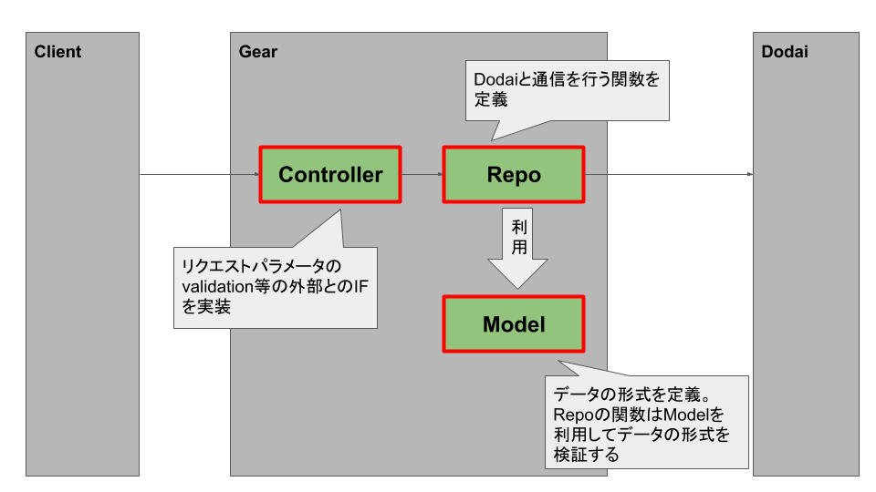

# Antikytheraが提供するModel/Repoの仕組みについて

## 概要

AntikytheraからDodaiを使うためにAntikytheraが提供しているmodel/repositoryという仕組みの説明です。

## 背景

昨今のWeb Serviceは一度リリースしてそれで終わりでなく、機能追加、バグ修正を継続的に行なっていくことが必要です。
そのため、Web Applicationの開発において重要なのは、メンテナブルなコードを維持し、効率的に開発できる状態を維持するということです。

一方でWeb Applicationのコードの開発においてよく発生する問題がFat Controllerと呼ばれる全ての処理をcontroller moduleに実装してしまう問題です。
仕様が追加、変更されるたびにcontroller moduleに処理が追加され、controller moduleが肥大化していくことで可読性が落ちていきます。
対策としては、実装を適切に別のmoduleに分けることでcontroller moduleが肥大化すること防ぐ手法が、多くのWeb Applicationの実装で用いられています。
([この資料](https://www.slideshare.net/OhasiYuki/ss-52193845)がわかりやすいです。)

ポイントとなるのはどのような方針でmoduleを分けるかです。
ここで、多くのWeb Aplication Serverの処理の実態は「データ」に対して何らかの「処理」をするということを実装することがほとんどです。
例えば、チャットサービスの場合ではユーザのメッセージ送信処理を行うとWeb Apllicationは「チャットメッセージ」という「データ」に対してDBに「保存する」という「処理」を行います。今回の実習のStackoverflow cloneでは質問を投稿するというユースケースがありますが、これは「Question」という「データ」をDodaiのData collectionのdocumentとして「作成」するという「処理」を行うことを意味します。
これを踏まえて重要なのは下記です。
* 扱うデータのフォーマットを定義する
  * 例えば、商品データであれば金額として負の値を取れないなど
* データを処理するロジックを書く
  * データをDBに保存する、検索するなど
* クライアント(browser等)とWeb Aplication間のやりとりするためのIFを定義する。

これを、踏まえ多くのGearでは下記のように処理をmoduleに分割しています。

* Controller
  * クライアントとGearとのIFを実装
    * request parameterのvalidationなど
      * 例: questionのタイトルは文字数は1~100文字であるかの「確認」
    * responseを返す。
  * データに対する処理の呼び出し(関数を呼び出すだけ)
* Repo
  * Dodaiへのデータの処理
    * 例: Data collectionのdocumentのinsert処理の関数の実装
      * Dodaiへデータを処理するときにModelで定義されたデータ特性を満たしているかを検証する。
    * この関数がController等から呼び出される。
* Model
  * データの特性の定義
    * 例: questionのタイトルの文字数は1~100文字であるという制限の「定義」
  * データに対するビジネスロジックの実装
    * controllerのデータに対する呼び出しが複雑になってきたら、一連の呼び出し処理を関数としてModelに実装
    * controllerはModelの関数を呼び出すだけにする。



たとえばBookの作成API([`web/controller/book/create.ex`](../../web/controller/book/create.ex))のControllerでは下記のように実装されています。
```
defun create(%Conn{request: %Request{body: body}} = conn) :: Conn.t do
  # parameterのvalidation
  case RequestBody.new(body) do
    {:error, _}      ->
      # エラーのレスポンスを返す
      ErrorJson.json_by_error(conn, BadRequest.new())

    {:ok, validated} ->
      data = to_book_data(validated)
      # DodaiのBook Collectionのdocumentを作成する処理。
      # 処理の実態はRB(BookのRepository module)の関数を「呼び出している」
      # つまり、documentを作成するという処理の実態はRepository moduleに実装されています。
      {:ok, book} = RB.insert(%{data: data}, StackoverflowCloneA.Dodai.root_key())

      # 成功レスポンスを返す
      Conn.json(conn, 201, Helper.to_response_body(book))
  end
end
```
このように、moduleを分割することでControllerでは全体の処理の流れがわかりやすくなっています。
このcontrollerでは下記の処理を行っています。
* パラメータを検証
  * 不正なパラメータだったらエラーレスポンスを返す
* Dodaiにdocumentを作成
* 成功レスポンスを返す

## Model/Repo機能

前述したようにModel/Repo moduleを適切に作って処理を分割していくことが可読性の高いコードを書くための有効な戦略です。
一方で、Dodaiを使ったGearの実装には多くの似通った部分があり、それらを毎回Gear実装者が書くのではなく、共通の部分は自動生成しGear独自の部分だけ新たに実装する仕組みがあると開発が効率的に行うことができます。
Antikytheraが提供するModel/Repo機能は多くのGearで共通して実装される部分を自動生成することで、Gear開発者がModel/Repo moduleを実装しやすくするための機能です。

下記ではBookに対するmodel/repoの実装をみながら中身を説明していきます。

## Modelの定義

model moduleはデータの特性を定義するためのmoduleです。Bookのmodelは[`lib/model/book.ex`](../../lib/model/book.ex)に下記のように定義されています。
```
use Croma

defmodule StackoverflowCloneA.Model.Book do
  @moduledoc """
  Book of StackoverflowCloneA app.
  """

  defmodule Title do
    use Croma.SubtypeOfString, pattern: ~r/\A.{1,100}\z/u # 1~100文字という文字列の型をTitleという名前で定義
  end
  defmodule Author do
    use Croma.SubtypeOfString, pattern: ~r/\A.{1,50}\z/u # 1~50文字という文字列の型をAuthorという名前で定義
  end

  use AntikytheraAcs.Dodai.Model.Datastore, data_fields: [ # data filedの中身を定義するための記法
    title: Title, # titleフィールドが存在し、その値の型としてTitleというmoduleで定義される型を指定。
    author: Author, # authroフィールドが存在し、その値の型としてAuthorというmoduleで定義される型を指定。
  ]
end
```

これは、bookの[仕様](../design/book.yml)に基づき、Dodaiのdocumentの特性を定義するためのコードです。仕様にあるように、data fieldのTitleやAuthorをを定義しています。
ここで特徴的なのが、data fieldの値のみを定義していることです。
しかし、Dodaiのdocumentのフォーマットは[ここ](https://github.com/access-company/Dodai-doc/blob/master/datastore_api.md#format-of-dataentity-document)に定義されるようにdataフィールド以外にも、`createdAt`などのフィールドがあります。
これらは定義しなくてもよいのでしょうか？なぜ、`data`フィールだけの定義が必要なのでしょうか？

答えは`data`fieldだけが任意のfieldを持つことができるためです。`createdA`などは`2013-10-22T13:27:46+00:00`のような時刻の値となることが定められており、開発者が勝手に変更することができません。そのため、`data`フィールド以外の部分はAntikytheraが自動で定義してくれます。
一方で`data`は開発者が任意の`field`を定義できます。そのため、modelの定義においても型を指定してあげる必要があります。


このように定義することにより、bookのデータがmodule名と同名の[struct](https://elixir-lang.org/getting-started/structs.html)として定義されます。
試しにこのstructとして具体的にはどういった値が使われるのかをみてみましょう。[`web/controller/book/show.ex`](../../web/controller/book/show.ex)の12行目を下記のように書き換えてください。
```
{:ok, book} -> IO.inspect(book); Conn.json(conn, 200, Helper.to_response_body(book))
```
その後、iexのserverが立ち上がっている状態で各自のterminal(iex consoleの中ではないです)で下記のcurlコマンドを入力ください。(idの部分は[Dodai Console](https://dodai-console.solomondev.access-company.com/login)で`_id`の値を確認してそれを使いましょう。)
```
curl -XGET http://stackoverflow-clone.localhost:8080/v1/book/id | jq
```

iexのconsoleに`data`フィールド以外の`createdAt`などのフィールドが現れたことがわかると思います。
一方で、(idの部分は[Dodai Console](https://dodai-console.solomondev.access-company.com/login)で`title`の値として101文字以上を使用するとエラーになります。これは事前に定義した仕様に違反しているためです。

## Repo

次にRepo moduleを紹介します。Repo moduleは実際にDodaiに対してdocumentを作成したり、取得したりするための関数を定義するmoduleです。
素晴らしいことにAntikytheraが用意している仕組みを使うことでDodaiに対して行う全ての処理の関数が自動で定義されます。
開発者が実装しないといけないことは、扱うcollection名とmodel moduleを指定することだけです。

Bookの例は[`lib/repo/book.ex`](../lib/repo/book.ex)で下記のように実装されています。
```
use Croma

defmodule StackoverflowCloneA.Repo.Book do # collection名はmodule名と一致させる必要があります。
  use AntikytheraAcs.Dodai.Repo.Datastore, [
    datastore_models: [StackoverflowCloneA.Model.Book], # modelとして先ほど作ったmodule名を指定しています。
  ]
end
```

上記のmoduleには関数を1つも実装していませんが、実際にはいくつかの関数が自動で生成されています。
iex consoleで
```
iex(1)> StackoverflowCloneA.Repo.Book
```
と入力し続けてタブをうつと関数の一覧が見えますので確認してみます。
また、関数に対して`h`をつけて関数を入力すると、関数の詳細が表示されます。例えば`insert`関数の場合は下記です。
```
iex(1)> h StackoverflowCloneA.Repo.Book.insert
```

※Model, Repo moduleはデータ種類ごとに作成する必要があります。例えば、Questionデータを触る場合は、Question用のModelとRepo moduleを別途作ってあげる必要があります。

## Dodai上のdocumentの操作

最後に、Repo moduleを利用したDodai documentの取得/作成方法をみていきます。

### Dodai documentの取得

Dodaiからdocumentを取得する関数は`retrieve/2`関数です。この関数の詳細はiex consoleで下記のようにして確認できます。
```
iex(1)> h StackoverflowCloneA.Repo.Book.retrieve
```
出力結果にありますように、下記の3つの引数をとります。
* id: 取得するdocumentのid
* key: 認証情報(`Authorization` headerに指定した値です)
* optionalな設定値

試しに下記のようにiex consoleで入力してみましょう。(root_keyの値は[Dodai Console](https://dodai-console.solomondev.access-company.com/login)で確認ください。)
```
iex(1)> StackoverflowCloneA.Repo.Book.retrieve("取得したいdocumentのid", "root_key")
```

無事取得でき、結果がModel moduleで定義したmoduleのstructとして定義されていることを確認しましょう。

### Dodai documentの作成

Dodaiからdocumentを取得する関数は`retrieve/2`関数です。この関数の詳細はiex consoleで下記のようにして確認できます。
```
iex(1)> h StackoverflowCloneA.Repo.Book.insert
```
出力結果にありますように、下記の3つの引数をとります。
* insert_action: どういったinsert処理をするかを指定するための値
* key: 認証情報(`Authorization` headerに指定した値です)
* optionalな設定値

insert_actionが難しいですね。下記のようにするとinsert_actionの詳細が確認できます。
```
iex(1)> t AntikytheraAcs.Dodai.Repo.Datastore.insert_action_t
```
下記の出力が得られたかと思います。
```
@type insert_action_t() :: %{
        optional(:_id) => nil | Dodai.GenericEntityId.t(),
        optional(:owner) => nil | Dodai.Owner.t(),
        optional(:sections) => nil | Dodai.Sections.t(),
        :data => map()
      }
```
これはinsert_actionは次のような特徴をもつ値であることを指しています。
* mapである
* mapのkeyとして`_id`が使える、これはoptionalな値(なくても良い値)
* mapのkeyとして`owner`が使える、これはoptionalな値(なくても良い値)
* mapのkeyとして`sections`が使える、これはoptionalな値(なくても良い値)
* mapのkeyとして`data`が使える
  * `data`の値はmapである。

つまり、下記のような値が上記の性質を満たす値です。
* `{data: %{}}`
* `{data: %{foo: "bar"}}`
* `{data: %{}, _id: "hogehoge"}`

一方で下記は上記の性質を満たしません。
* `{_id: "hogehoge"}`
  * `data`がない
* `{data: "hoge"}`
  * `data`の値がmapでなく文字列。

insert_actionは一体何者かというと[Document作成API](https://github.com/access-company/Dodai-doc/blob/master/datastore_api.md#create-a-new-document)のrequest bodyを指しています。
fieldの値や必須であるかどうかなどが同じ関係になっていることがわかると思います。
curlでDodaiにdocumentを作成するときにこれらの値を指定して作成したと思いますが、同じように関数を使って作成する場合も同じ情報を指定してあげる必要があります。

試しに下記のようにしてdocumentを作成してみましょう。
```
iex(1)> StackoverflowCloneA.Repo.Book.insert(%{data: %{title: "好きな文字列を指定ください", author: "好きな文字列を指定ください"}}, "root_key")
```
うまく成功したら、[Dodai Console](https://dodai-console.solomondev.access-company.com/login)で実際に作成できているかみてみましょう。
次に下記をためしてみましょう。
```
iex(1)> StackoverflowCloneA.Repo.Book.insert(%{data: %{title: "好きな文字列を指定ください"}}, "root_key")
```
エラーになったと思います。
これはmodel moduleで定義したBookの特性(authorというfieldが必須)を満たしていないためです。
データの特性をあらかじめ定義しておいたことで、正しくない値をもつdocumentが生成されることを防いでくれます。

## まとめ

ここまで述べたmodel/repoの機能を使うことで下記が実現できます。
* 処理を適切にmoduleに分割し、可読性の高いコードを書くことができる
* 大半の処理が自動生成されるので、使い方を覚えれば開発効率を非常にあげることができる
* 自動生成される処理では適切なvalidationを自動で行ってくれるので、間違いを早めに検知できる

Web Applicationでは「データ」に対して何らかの「処理」をすることが多いということを記述しましたが、コードを実装する上で一番気をつけたいのが、不正なデータを作成するということを防ぐことです。
不正なデータができてしまうと、そのデータにより後続の処理が不具合を起こしたり、不正なデータがさらに不正なデータを生むことにつながる場合があります。
例えば、オンラインショッピングのサイトで金額がマイナスの商品(データ)が登録され他場合を想像してみましょう。それを購入したお客さんへの請求や、月々の売り上げを計算したデータなど様々な部分に影響が波及してしまう場合があります。
別会社のサービスとデータの連携などを行っていると取り返しがつかなくなることもあります。

そういった理由からデータの特性を定義して、その特性を必ず満たすことを検証しながら様々な処理を書くことができる機構は非常に有用です。
うまく活用しましょう。
