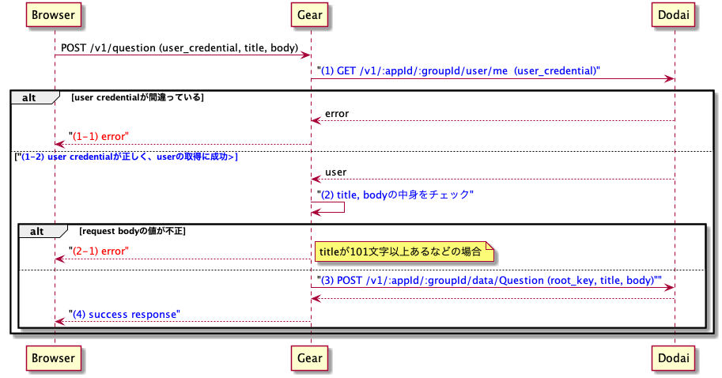

# Server実習1日目

# 内容

* `Question` APIとして下記のAPIを実装する
  * `createQuestion API`       (`POST /v1/question`)
  * `updateQuestion API`       (`POST /v1/question/{id}`)

# Question作成フロー

`createQuestion API`ですべきことは、ユーザがログイン済みであるかを確認して、ログイン済みであれば、ユーザが指定した値(titleとbody)に基づきQuestionを作成することである。


1. Dodaiからuser credentialで[このAPI](https://github.com/access-company/Dodai-doc/blob/master/users_api.md#query-information-about-logged-in-user)を叩いてuserを取得する
   1. 取得に失敗した場合はエラーを返す。
   1. 取得に成功した場合はログイン済みとみなす。
1. titleやbodyの値の検証する。
   1. [仕様](../spec/api_spec.yml)に従い、不正な値(titleが101文字以上など)の場合はエラーを返す。
1. DodaiのQuestionのdocumentを作成する。
   * 指定されたtitleやbodyの値を使ってdocumentを作成する。
     * dataの部分を組み立てよう。
     * user_idはログインしているuserのidを使う。
   * Dodaiに対してリクエスト
1. 成功レスポンスを返す。

# 詳細

## 1. Dodaiからuser credentialで[このAPI](https://github.com/access-company/Dodai-doc/blob/master/users_api.md#query-information-about-logged-in-user)を叩いてuserを取得する

* 認証について
  * `createQuestion API`ではログイン済みであること、`updateQuestion API`ではさらにログインUserと更新対象の`Question`の投稿者が同じであることを確認する必要がある。
    * なおユーザについては事前に講師側で作成してある。ログインのために必要なemailとpasswordは[ここ](https://docs.google.com/spreadsheets/d/1CtNNe1psPhbl0rGZa7BVqCoVDIgitpBnS7XTM7xpScs/edit#gid=532304691)を参照。
  * 「ログイン済み」とはユーザが事前にログインAPI(`userLogin API`)を叩き、user credential(レスポンスの`session`の`key`の値)をheaderの`authorization`の値として設定してAPIを叩くことを意味する。
    * 例えば、`createQuestion API`の場合は下記のようなcurlコマンドとなる
      ```
      curl -XPOST -H "authorization: <user credential>" -H "Content-type: application/json" -d '{"title":"title","body":"body"}' <url>/v1/question | jq
      ```
  * gear側の処理としてはこのuser credentialが正しいかを確認する。
  * 正しいかどうかは[この API](https://github.com/access-company/Dodai-doc/blob/master/users_api.md#query-information-about-logged-in-user)を用いて確認できる。
    * gearはheaderからuser credentialを抜き出して、このAPIのパラメータとして設定して上記のAPIを叩く。
    * 上記のAPIはuser credentialが正しい場合、そのcredentialをもつユーザの情報を取得できる。ユーザの情報の取得に成功した場合、「ログイン済み」であると判断する。
      * `updateQuestion API`の場合はここから更にこのユーザのIDとquestionの投稿者のID(`Question`の`data.user_id`)が一致しているかを確認する必要がある。
    * user credentialが正しくない場合、「ログイン済み」でないとしてエラー(401)を返す。
  * 上記の「headerの`authorization`の値をもとにユーザ情報を取得する」という処理はすでに講師側で実装しましたので、それを使うことができます。
    * 実装は[`plug`](https://github.com/access-company/antikythera/blob/master/lib/web/controller/plug.ex)という機能を用いて[ここ](../../web/plug/fetch_me.ex)で実装されています。
    * この`plug`は`authorization`の値をもとにユーザ情報を取得して、その情報をactionに渡ってくる引数の`conn`の`assigns`の`me`とフィールドに取得したユーザの情報を格納してくれます。
    * この`plug`は下記のように記述することで、同じmodule内で書かれたactionの「実行前」に自動で呼び出されます。
      ```
      defmodule StackoverflowCloneA.Controller.Question.Create do
        use StackoverflowCloneA.Controller.Application

        # plugを使うことを宣言
        plug StackoverflowCloneA.Plug.FetchMe, :fetch, []

        # 下記のcreate actionが実行される前に上記のplugが実行される
        def create(conn) do
          # connのassignsにheaderのauthorizationの値をもとに取得したユーザの情報が入っている
          json(conn2, 201, %{})
        end
      end
      ```
      * 上記のcreate actionの引数connは下記の様になっており、`assings`の`me`というフィールドにユーザの情報が入っていることが分かる。
      ```
      %Antikythera.Conn{
        context: %Antikythera.Context{...},
        request: %Antikythera.Request{...},
        :
        assigns: %{
          me: %{
            "_id"            => "5ad7fb9e38000038001cb5bf",
            "email"          => "masaki.takahashi11@access-company.com",
            "createdAt"      => "2018-04-19T02:14:54+00:00",
            "updatedAt"      => "2018-04-19T02:14:54+00:00",
            "version"        => 0,
            "data"           => %{},
            "readonly"       => %{},
            "role"           => %{},
            "sectionAliases" => [],
            "sections"       => [],
            "session"        => %{
              "expiresAt"     => "2018-04-20T02:18:17+00:00",
              "key"           => "Cx6mX5RHiCIVmEpa51tB",
              "passwordSetAt" => "2018-04-19T02:14:54+00:00"
            },
          }
        },
      }
      ```
  * この`plug`はcredentialが正しくない場合、401エラーを返してくれる。そのため、`createQuestion API`の実装をする際には`plug`の使うことを宣言するだけでログインユーザの検証は完了である。
  * 一方`updateQuestion API`の実装では`conn`の`assigns`の`me`の`_id_`と更新対象のquestionの`data.user_id`の値が一致しているかの確認が追加で必要である。

## 2.titleやbodyの値の検証する

* cromaを使ってvalidationする。
* `Croma.Struct`を利用したvalidationは下記のstepとなる
  1. `Croma.Struct`を利用してstructを宣言的に定義する
  1. 自動生成される`new/1`関数を用いてreqest bodyをvalidationする。
     * 宣言したstructを満たすmapであれば、`{:ok, XXX}`が返り、そうでなければ`{:error, XXX}`が返る。
  1. 返り値により分岐を行い、`{:ok, XXX}`であれば次の処理、`{:error, XXX}`であれば、クライアントには404エラーを返し処理を終了する。
* 具体的な`Croma.Struct`の使用例は[ここ](./croma.md)を参照
* 使用例は[web/controller/book/create.ex](../../web/controller/book/create.ex)を参考にする。

## 3. DodaiのQuestionのdocumentを作成する

* [model/repoの機能](https://github.com/access-company/stackoverflow_clone_a/blob/master/doc/training/model_repo.md)を用いてDodaiのQuestion collectionにdocumentの作成を行います。
  * `StackoverflowCloneA.Repo.Question.insert/3`関数を使って作成します。
  * 第一引数を何にするかがポイント
  * 使用例は[web/controller/book/create.ex](../../web/controller/book/create.ex)を参考にする。

## 成功レスポンスを返す

* [仕様](../spec/api_spec.yml)にあるように下記のJSONを返す。
  ```
  {
    "id": "作成されたdocumetの_id",
    "title": "作成されたdocumetのtitle",
    "body": "作成されたdocumetのbody",
    "user_id": "作成されたuserの_id",
    "created_at": "documentが作成された時刻",
    "comments": [], # この時点では空配列
    "like_voter_ids": [], # この時点では空配列
  }
  ```
* Question structを上記の形のmapに変換する関数`Helper.to_response_body/1`を用意しているので、これを使うのが楽。
  * 使用例: `Conn.json(conn, 201, Helper.to_response_body(question))`
