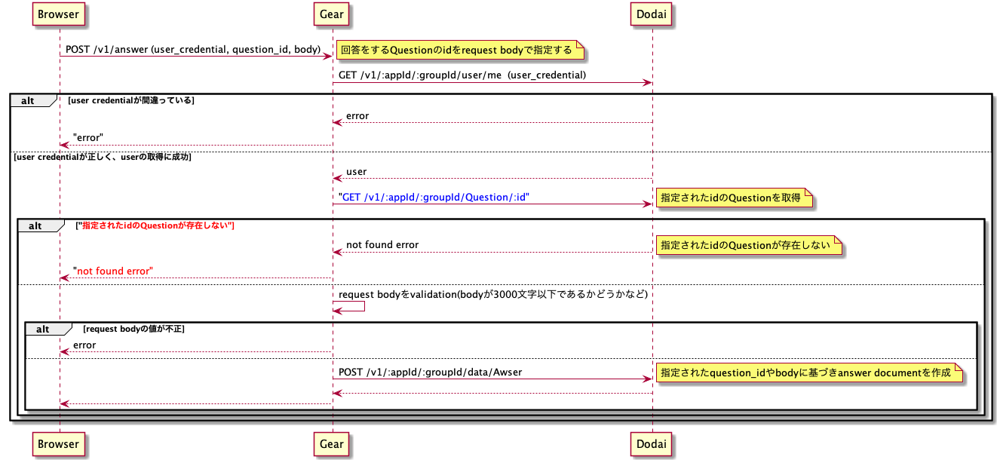

# Server実習2日目

# 内容

* `Answer` APIとして下記のAPIを実装する
  * `createAnswer API`       (`POST /v1/answer`)
  * `retrieveAnswerList API` (`GET  /v1/answer`)
  * `updateAnswer API`       (`POST /v1/answer/{id}`)
  * `retrieveAnswer API`     (`GET  /v1/answer/{id}`)
    * `user_id`と`question_id`での検索はスキップしてよい。(3日目に実施)

# 詳細

基本的にはQuestionのAPIの作成とほぼ同じ。下記に注意点を記述。

## まず最初に

GearからAnswer documentを操作するために、Questionの場合と同じようにAnswer用のmodel/repo moduleの作成が必要です。
[ドキュメント](./model_repo.md)を元に、questionと同じように[model module](../../lib/model/answer.md)とrepo module[repo module](../../lib/repo/answer.md)を作成しましょう。

## show関数(`retrieveAnswer API`), index関数(`retrieveAnswerList API`), update関数(`updateAnswer API`)

ほぼQuestionの場合と同じなのでQuestionを参考にする。

## create関数(`createAnswer API`)

* Questionの場合とほぼ同じだがだが、下記のように「Questionが存在するかどうか」の確認が必要。(存在しないQuestionにAnswerが存在してはいけない)
  
* 実際に作成するdocumentは[仕様](../design/collection.md#answer-collection)に従い、`data`部分をユーザが指定した値に基づき組み上げてあげることになる。
  ```
  {
    "_id"        =>  "5ac458653700003700ec2b3e"
    "version"    =>  0,
    "updated_at" => "2018-04-04T04:45:25+00:00",
    "created_at" => "2018-04-04T04:45:25+00:00",
    "sections"   =>  [],
    "owner"      => "_root",      "data"       => {
      "user_id"     => "5abc7c5f3700003700eb5945", # login userの`_id`
      "question_id" => "5abc7c7c3800003800748888", # userが指定した値
      "body"        => "body3"                     # userが指定した値
      "comments"    => [],                         # 最初は必ず空配列
    },
  }
  ```
