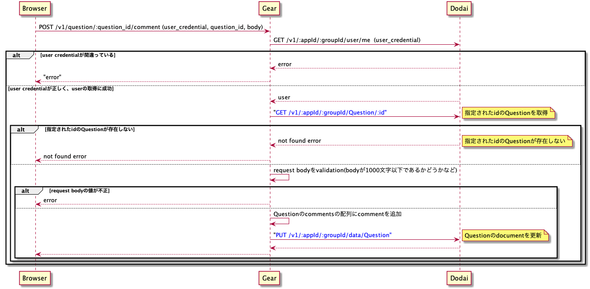

# Server実習4日目

# 内容

* `Comment` APIとして下記のAPIを実装する
  * `createComment API` (`POST /v1/question/{:question_id}/comment`, `POST /v1/answer/{:answer_id}/comment`)
  * `updateComment API` (`POST /v1/question/{:question_id}/comment/{id}`, `POST /v1/answer/{:answer_id}/comment/{id}`)

# 概要

CommentはQuestionやAnswerと違い、専用の**collectionが存在しない。**
Commentを作成するとはQuestion/Answer documentのcommentsフィールドにドキュメントを追加するということを意味する。
  * コメントが存在しないQuestionのdocument
    ```
    {
      "_id"        => "5abc7c7c3800003800748888"
      "version"    => 0,
      "created_at" => "2018-03-29T05:41:16+00:00",
      "updated_at" => "2018-03-29T05:41:16+00:00",
      "sections"   => [],
      "owner"      => "_root",
      "data"       => {
        "user_id"           => "5abc7c5f3700003700eb5945",
        "title"             => "title",
        "body"              => "body",
        "like_voter_ids"    => [],
        "dislike_voter_ids" => [],
        "comments"          => [],
      },
    }
    ```
  * commentを1件追加したあとのQuestionのdocument
    ```
    {
      "_id"        => "5abc7c7c3800003800748888"
      "version"    => 0,
      "created_at" => "2018-03-29T05:41:16+00:00",
      "updated_at" => "2018-03-29T05:41:16+00:00",
      "sections"   => [],
      "owner"      => "_root",
      "data"       => {
        "user_id"           => "5abc7c5f3700003700eb5945",
        "title"             => "title",
        "body"              => "body",
        "like_voter_ids"    => [],
        "dislike_voter_ids" => [],
        "comments"          => [
          {
            "id"         => "N6MeNogNEs34JkgZPg9l",      # 上記の方法でランダムな文字列を生成
            "user_id"    => "5abc7c5f3700003700eb5945",  # login userの`_id`
            "body"       => "body1"                      # userが指定した値
            "created_at" => "2018-04-04T04:53:57+00:00", # comment作成時の時刻
          }
        ],
      },
    }
    ```

つまり、Questionに対するComment追加のフローは下記のようになる。


# 詳細

## Commentの作成/更新のためのDodaiのリクエストについて

今まで、Question/Answerのdocumentを作成したり更新したりするときは専用のmodel moduleやrepo moduleを定義した上で、Repo moduleの関数を使って操作してきた。
しかし、Commentの追加/更新は対応するQuestion/Answer documentの更新を行うことに等しい。
そのため、Commentのために専用のmodel/repo moduleを使う必要はなく、Question/Answerもrepo moduleのupdate関数を使うことになる。
つまり、下記のように第一引数に渡す値として`comments`にcommentを追加したQuestionのdataとなるように指定する。
```
StackoverflowCloneAA.Repo.Question.update(data, id, StackoverflowCloneA.Dodai.root_key())
```

## Commentのためのデータの生成について

コメントデータは下記のように、`created_at`として現在時刻を設定する必要がある。
現在時刻はAntikytheraが提供する[ライブラリ](https://github.com/access-company/antikythera/tree/master/lib/util)を使えば取得できる。
(適切なライブラリを探し使う。)
```
{
  "id"         => "N6MeNogNEs34JkgZPg9l",      # 上記の方法でランダムな文字列を生成
  "user_id"    => "5abc7c5f3700003700eb5945",  # login userの`_id`
  "body"       => "body1"                      # userが指定した値
  "created_at" => "2018-04-04T04:53:57+00:00", # comment作成時の時刻
}
```

## その他注意点

下記に注意して実装しましょう。
* commentの更新をできるのはcommentを投稿したuserのみ。
  * 他人が投稿したコメントを編集できてはいけないため。
* commentの配列の要素の順番は更新によって変わってはいけない。
  * commentの配列の順番はcommentが表示される順なので、順番が変わってしまうとユーザは違和感を覚える。
* question/answerに対するcommentの追加/更新はほぼ同じ処理である。
  * 余裕があればがんばって共通化するなど工夫しましょう。
* gearのresponse bodyは今までと異なりcomment部分だけを返すことに注意。
  * 期待値は[doc/spec/api_spec.yml](../spec/api_spec.yml)を参照。

