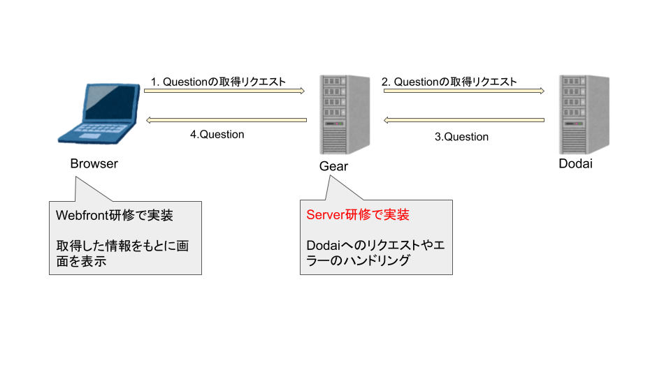

# Gear開発ハンズオン

この実習では

# 内容

* [Setupドキュメント](../development.md)に従い、ベースとなるgearのSetupを行なう。
* 開発するGearの設計について理解する。
* `retrieveQuestion API`を実装する。

# gearのSetup

* [Setupドキュメント](../development.md)に従い、ベースとなるgearのSetupを行なう。

# Gearの設計について

* 設計は[ここ](../design/collection.md)を参照。

# 処理の概要



# `retrieveQuestion API`の実装

`retrieveQuestion API` (`GET /v1/question/:id`)の実装を下記の流れで行なう。
1. router, controllerとactionを定義する。
1. actionの中身を実装する。
   1. パラメータからidを抜き出す。
      * 動作確認のために抜き出したidを返すだけの処理の実装。
   2. Dodaiから指定されたidのQuestionを取得する。
1. テストを実装する。

## 1. router, controllerとactionを定義する。

まずstatusが`200`でbodyが`{}`のresponseが返るように実装する。
* `web/router.ex`でのroutingの定義。
* `web/controller/question/show.ex`ファイルを新規作成し、routingと対応するactionの関数を実装する。
  * actionの中身は[`json`](https://hexdocs.pm/antikythera/Antikythera.Conn.html#json/3)を使って、statusが`200`でbodyが`{}`のresponseが返るように書く。

`curl -XGET http://{URL}:8080/v1/question/id`でresponseを確認。

## 2. actionの中身を実装する。

### 2-1. パラメータからidを抜き出す


1. `Conn`の`path_matches`から取得対象の`Question`の`id`を抜き出す。
   * `Conn.t`のtypeは[ここ](https://hexdocs.pm/antikythera/Antikythera.Conn.html#t:t/0)を参照
   * action内で`IO.inspect conn`などどするとconnの下記のように具体的な中身が確認できます。
     ```
     %Antikythera.Conn{
       assigns:     %{},
       before_send: [],
       context:     %Antikythera.Context{...},
       request:     %Antikythera.Request{
         body:         "",
         raw_body:     "",
         cookies:      %{},
         headers:      %{"accept" => "*/*", "host" => "stackoverflow-clone.localhost:8080", "user-agent" => "curl/7.54.0"},
         method:       :get,
         path_info:    ["v1", "question", "5abc7c7c3800003800748888"],
         path_matches: %{id: "5abc7c7c3800003800748888"}, # <= ここから`/question/:id`のpath中で`:id`として指定した値が取得できる。
         query_params: %{},
         sender:       {:web, "127.0.0.1"}
       },
       resp_body:    "",
       resp_cookies: %{},
       resp_headers: %{},
       status:       nil
     }
     ```
   * 抜き出したidを使って`{"id" => 抜き出したid}`のjsonが返るようにしてみましょう。
   * `curl -XGET http://{URL}:8080/v1/question/id`でresponseを確認。

### 2-2. Dodaiから指定されたidのQuestionを取得する

Dodaiに対してリクエスト処理はAntikytheraが提供するmodel/repo機能を使って実装します。
具体的には下記のステップを踏みます。
* Questionのmodelを定義する。
* QuestionのRepositoryを定義する。
* 上記を使ってDodaiに対してリクエストする。

model/repo機能についての説明が必要なため、まずは[ここ](./model_repo.md)に従いBook APIを例にして説明します。

#### modelの定義

[Questionの定義](../design/collection.md)をみながら、`lib/model/question.ex`に下記のようなmoduleを定義してみましょう。

```
use Croma
defmodule StackoverflowCloneA.Model.Question do # module名のQuestionの部分はmodelの名前
  @moduledoc """
  Question of StackoverflowCloneA app.
  """
  defmodule Title do
    use Croma.SubtypeOfString, pattern: ~r/\A.{1,100}\z/u
  end
  defmodule Body do
    # Bodyの型定義をしてみよう
  end
  defmodule VoterIdList do
    # VoterIdListの型定義をしてみよう
  end
  defmodule CommentList do
    # VoterIdListの型定義をしてみよう
  end
  defmodule StackoverflowCloneA.DodaiId do
    # See [RFC3986](https://tools.ietf.org/html/rfc3986#section-2.3) for the specifications of URL-safe characters
    @url_safe_chars "0-9A-Za-z\-._~"
    use Croma.SubtypeOfString, pattern: ~r"\A[#{@url_safe_chars}]+\Z"
 end
  use AntikytheraAcs.Dodai.Model.Datastore, data_fields: [
    title:             Title, # titleフィールの型として上で定義した型を指定
    body:              # 適切な型を指定しよう
    user_id:           StackoverflowCloneA.DodaiId,
    like_voter_ids:    # 適切な型を指定しよう
    dislike_voter_ids: # 適切な型を指定しよう
    comments:          # 適切な型を指定しよう
  ]
end
```

#### repositoryの定義

`lib/repo/question.ex`に下記のようなmoduleを定義してみましょう。
```
use Croma

defmodule StackoverflowCloneA.Repo.Question do # module名のQuestionの部分はcollectionの名前
  use AntikytheraAcs.Dodai.Repo.Datastore, [
    datastore_models: [上記で定義したmodelのmodule名を記載],
  ]
end
```

ここまでできたら、iex consoleで下記のように入力してうまくいっているか試してみましょう。
```
iex(1)> StackoverflowCloneA.Repo.Question.retrieve_list(%{}, StackoverflowCloneA.Dodai.root_key())
```

#### controller処理の実装

ここまでしたことを組み合わせて、controllerの残りの処理を実装しましょう。すべきことは下記です。
* `conn`からユーザが指定したQuestionの`id`を抜き出す
* 抜き出したidをもとにRepository moduleの関数を使ってDodaiからQuestionを取得
* [仕様に合った形](../doc/spec/api_spec.yml#L664)に変換してresponseを返す
```
use Croma

defmodule StackoverflowCloneA.Controller.Question.Show do
  use StackoverflowCloneA.Controller.Application
  alias StackoverflowCloneA.Controller.Question.Helper

  defun show(conn :: v[Conn.t]) :: Conn.t do
    # connからidを抜き出しましょう。

    # StackoverflowCloneA.Repo.Question.retrieve/2を使ってDodaiからQuestionを取得しましょう。

    # Questionを仕様に合う形に変換しましょう。
    # 変換関数として`StackoverflowCloneA.Controller.Question.Helper.to_response_body`を予め実装しておきましたのでこれを使いましょう。
  end
end
```

実装できたら`curl -XGET http://{URL}:8080/v1/question/id`でresponseを確認してみましょう。(idの部分は[Dodai Console](https://dodai-console.solomondev.access-company.com/login)で`_id`の値を確認してそれを使いましょう。)

## 3. テストを実装する

下記の流れで実装する。
1. `test/web/controller/question/show_test.exs`ファイルを作成し、下記のコードを記載します。
   ```
   defmodule StackoverflowCloneA.Controller.Question.ShowTest do
     use StackoverflowCloneA.CommonCase

     test "show/1 " do
       assert true
     end
   end
   ```
   ※ [`assert`](https://hexdocs.pm/ex_unit/ExUnit.Assertions.html#assert/1)は[ExUnit](https://hexdocs.pm/ex_unit/ExUnit.html)が提供する値が`true`であることを確認する関数であり、期待する値とテストしたい関数の演算結果を比較するために用います。
   下記のコマンドでテストを実行し、成功することを確認しましょう。
   ```
   $ mix test test/web/controller/question/show_test.exs
   ```
2. `test`の中身を実装します。
   - 具体的には、`GET /v1/question/id`のリクエストを行い、その結果が期待値と一致しているかを`assert`で確認するロジックを書きます。
   1. `GET /v1/question/id`のリクエストは[このmodule](https://github.com/access-company/antikythera/blob/master/lib/test/http_client.ex)で提供される関数を使って実現できます。
      * [`retrieveQuestionList API`のテスト](../../test/web/controller/question/index_test.exs)が参考になります。
   1. dodaiへのrequestをmockします。
      * これは、`GET /v1/question/id`のリクエストを行なうと(sazabi経由で)dodaiに対してrequestされてしまい、dodai上のリソースに応じて処理結果がかわってしまうため、dodai上のデータに依存しない形でテストを記述するためです。
      * [`meck`](https://github.com/eproxus/meck)を利用して`StackoverflowCloneA.Repo.Question.retrieve/3`の中身をmockします。
      * 具体的には`meck.expect/3`を使うことで下記のようにfunctionの動作をmockできます。
        ```
        defmodule Hoge do
          def foo(x) do
            x + 1
          end
        end

        > Hoge.foo(1)
        2

        # Hoge.foo/1の処理を書き換える
        :meck.expect(Hoge, :foo, fn(x) -> x + 2 end)

        > Hoge.foo(1)
        3
        ```
        ※引数の数は正確に記述する必要があります。数が違っているとmockが適用されません。
        ```
        defmodule Hoge do
          # 引数が2つの関数を定義
          def foo(x, y) do
            x + y
          end
        end

        > Hoge.foo(1, 2)
        3

        # `fn`の引数が2つになるように定義
        :meck.expect(Hoge, :foo, fn(x, y) -> x + y + 2 end)

        > Hoge.foo(1, 2)
        5
        ```
        この仕組を利用して、`StackoverflowCloneA.Repo.Question.retrieve/3`が成功のresponseと失敗時のresponseをシミュレートしてあげます。
        具体的には下記のような形で実装してみましょう。
        ```
        defmodule StackoverflowCloneA.Controller.Question.ShowTest do
          use StackoverflowCloneA.CommonCase
          alias StackoverflowCloneA.Repo.Question, as: RQ
          alias StackoverflowCloneA.TestData.QuestionData

          @question   QuestionData.model()
          @api_prefix "/v1/question/#{@question._id}"

          # 正常系のテスト
          test "show/1 " <>
            "it returns question" do
            # meckをここで設定
            :meck.expect(RQ, :retrieve, fn(id, _key) ->
              # retrieve関数に指定されたidがAPIのpathで指定されたidと等しいかを確認。
              assert id == @question._id

              # 成功時のresponseをここで返してあげましょう
            end)

            # requestを送信
            res = Req.get(@api_prefix)
            # http statusを検証
            assert res.status               == # 期待される値を指定してください
            # http response bodyを検証
            assert Poison.decode!(res.body) == QuestionData.gear()
          end

          # 指定してidが間違っていたDodaiからエラーが帰ってきた場合のテスト
          test "show/1 " <>
            "when dodai returns ResourceNotFound, " <>
            "it returns ResourceNotFound" do
            :meck.expect(RQ, :retrieve, fn(_id, _key) ->
              # エラー時のresponseをここで返してあげましょう
            end)

            res = Req.get(@api_prefix)
            assert res.status               == # 期待される値を指定してください
            # response bodyがエラーとなっていることを検証
            assert Poison.decode!(res.body) == %{
              "code"        => "404-04",
              "description" => "The resource does not exist in the database.",
              "error"       => "ResourceNotFound",
            }
          end
        end
